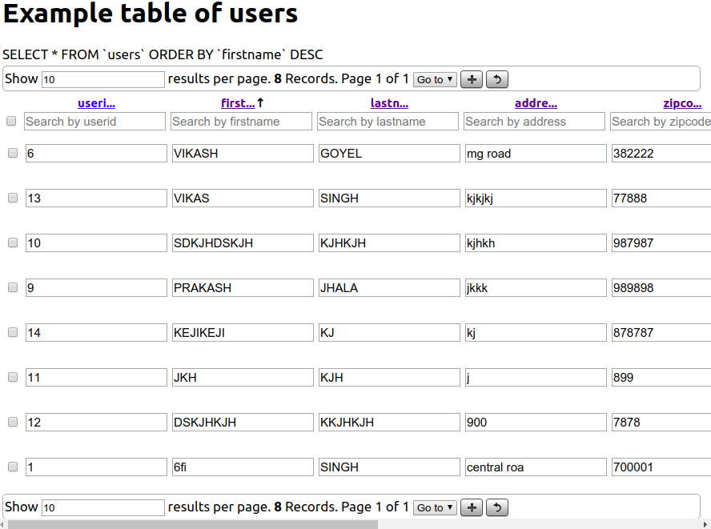

# phpMyTable
A PHP class which provides a live editable interface to a MySQL table.

## Usage
1. Download the zip and extract in a subfolder of www (i.e. www/apps); there should be two folders pmt and dropdown
2. Open pmt_example.php; follow the instructions in the file
3. Save and run localhost/www/pmt/pmt_example.php (or whatever your path is)
4. Copy and rename pmt_example.php for more tables

See it running live at https://phpmytable.000webhostapp.com/pmt/index.php
